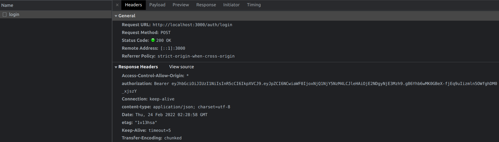

# 1. Install Strapi

https://docs.strapi.io/developer-docs/latest/getting-started/quick-start.html

Use the current Node LTS version <b>16.13.2</b> to install Strapi.

`nvm use lts/*`

`npx create-strapi-app@latest strapi-demo --quickstart`

When the installation is finished you will fill in the Super Admin user data under `http://localhost:1337/admin/`.

Be sure to understand that with this Super Admin user you cannot make authenticated requests, you will have to create an End User for that use case.

<br />
<i>
Simply put, an <b>Admin User</b> can access the Strapi dashboard. An Admin User may create content types, add content, manage API access, install plugins, etc.
<br />
<br />
An <b>End User</b> can only consume the API. This may include adding content but through the GET/POST methods in a form - not the Strapi dashboard. For example, for an ecommerce account, to leave a comment/review, to be the author of an article or otherwise have a profile.
</i>

https://strapi.io/blog/why-we-split-the-management-of-the-admin-users-and-end-users

<br />
<br />
<b>The Strapi Dashboard > Settings then looks like this.</b>


<br />
<br />
<br />
<br />

<b>Under Strapi Dashboard > Users you can see the Super Admin user.</b>


<br />
<br />
<br />
<br />

# 2. Create Content Type Employee with Content-Type-Builder

Here is Strapi documentation on how to create a content type with the Content-Type builder.  
https://docs.strapi.io/developer-docs/latest/getting-started/quick-start.html#%F0%9F%9B%A0-part-b-build-your-content

<b>I created a content type "Employee" with the following fields.</b>


<br />
<br />
<br />
<br />

# 3. Add Data for the Content-Type Employee

<b>I added John Smith as an employee. Make sure you PUBLISH the data once done.</b>


<br />
<br />
<br />
<br />

# 4. Set Public Permission on the `/api/employees` Route

By default a newly created content type, i.e. employee, has no public permissions.

<b>I allow `find` and `findOne` for the Public role of an unauthenticated user.</b>


<br />
<br />
<br />
<br />

<b>This means under `http://localhost:1337/api/employees/` the data of John Smith the employee will be served to anyone.</b>


<br />
<br />
<br />
<br />

# 5. Register an Authenticated End User through the Strapi API

The Authenticated role is the default role that is given to every new user if no role is provided at creation.

When you create an End User without a role or if you use the `/api/auth/local/register` route, the authenticated role is given to the user.

https://docs.strapi.io/developer-docs/latest/plugins/users-permissions.html#authenticated-role

```javascript
// Register.svelte

async function register() {
	payload = {
		username: username,
		email: email,
		password: password
	};
	console.log(payload);

	try {
		const response = await fetch('http://localhost:1337/api/auth/local/register', {
			method: 'POST',
			headers: {
				'Content-Type': 'application/json'
			},
			body: JSON.stringify(payload)
		});

		if (response.ok) {
			const responseDetails = await response.json();
			// console.log(responseDetails);

			const jwt = responseDetails.jwt;
			console.log(jwt);

			if (jwt) {
				try {
					const response = await fetch('/auth/register', {
						method: 'POST',
						headers: {
							'Content-Type': 'application/json'
						},
						body: JSON.stringify(jwt)
					});

					const responseDetails = await response.json();
					console.log(responseDetails);
				} catch (error) {
					console.log(error);
				}
			}
		}
	} catch (error) {
		console.log(error);
	}
}
```

The above code has two fetch calls. One that deals with registering the new End User and another one that deals with setting up the received JWT from Strapi on the SvelteKit endpoint.
This does not feel "quite right" to me.

I think it is "better" to send the user given data to register a new End User to the SvelteKit endpoint `auth/register` first and there continue to deal with Strapi and the returned JWT.

```javascript
// Register.svelte

async function register() {
	payload = {
		username: username,
		email: email,
		password: password
	};
	console.log(payload);

	try {
		// we just "forward" the End User credentials to be dealt with by Strapi in the SvelteKit endpoint
		const response = await fetch('/auth/register', {
			method: 'POST',
			headers: {
				'Content-Type': 'application/json'
			},
			body: JSON.stringify(payload)
		});

		if (response.ok) {
			const responseDetails = await response.json();
			console.log(responseDetails);
		}
	} catch (error) {
		console.log(error);
	}
}
```

```javascript
// /auth/register.js

export async function post({ request }) {
	const payload = await request.json();
	console.log(payload);

	try {
		// getting the the End User credentials from the client we now deal with Strapi and the JWT on the server
		const strapiResponse = await fetch('http://localhost:1337/api/auth/local/register', {
			method: 'POST',
			headers: {
				'Content-Type': 'application/json'
			},
			body: JSON.stringify(payload)
		});

		if (strapiResponse.ok) {
			const strapiResponseDetails = await strapiResponse.json();
			console.log(strapiResponseDetails);

			const jwt = strapiResponseDetails.jwt;
			console.log(jwt);

			if (jwt) {
				const headers = {
					Authorization: 'Bearer ' + jwt
				};
				return {
					status: 200,
					headers,
					body: {
						message: 'Server says : Registration successful'
					}
				};
			}
		}
	} catch (error) {
		console.log(error);
	}
}
```

<b>Logs from these calls then result in successful return of the End User data and the JWT.</b>

<br />

<br />
<br />
<br />
<br />
